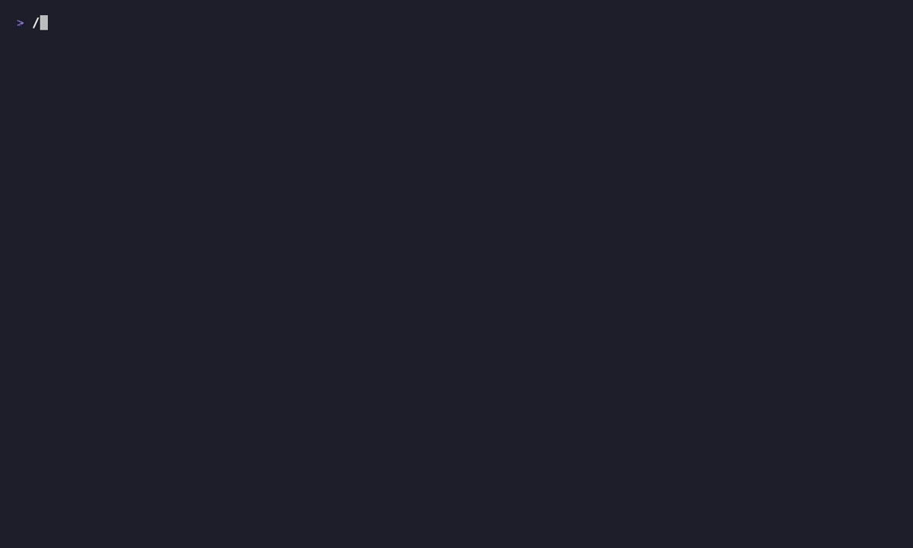

# SomaFM Player

A terminal (TUI) player for [SomaFM](https://somafm.com) Icecast streams, built in Go with [Bubble Tea](https://github.com/charmbracelet/bubbletea).



*Recorded with [VHS](https://github.com/charmbracelet/vhs); regenerate with `vhs docs/demo.tape`.*

## Features

- Browse SomaFM's channel list and play any station directly from the terminal.
- Live "Now Playing" track and artist info, read from the stream's ICY metadata.
- Automatic reconnection if a stream drops.
- Bookmark favorite channels and favorite tunes for quick access.
- Session history of recently played tracks.
- Volume control and mute/unmute.
- A live equalizer/spectrum visualizer of the audio.
- Channel-aware ASCII logo banner above the Now Playing panel.
- Switchable color themes: Nord, Dracula, Gruvbox, Tokyo Night, Solarized Dark, Solarized Light.
- Settings (bookmarks, volume, theme, last-played channel, visualizer toggle) persist across sessions.

## Requirements

- Go 1.26 or later.
- A working audio output device (playback uses [oto](https://github.com/hajimehoshi/oto) for cross-platform PCM output).

## Installation

**With `go install`:**

```sh
go install github.com/jonasbn/somafm-player@latest
```

This places a `somafm-player` binary in `$(go env GOPATH)/bin` (make sure that's on your `PATH`).

**From source:**

```sh
git clone https://github.com/jonasbn/somafm-player.git
cd somafm-player
go build -o somafm-player .
```

Then run the resulting binary, e.g. `./somafm-player`.

**From a downloaded release binary:**

Download the `.tar.gz` for your Mac's architecture from the
[Releases page](https://github.com/jonasbn/somafm-player/releases), then:

```sh
tar -xzf somafm-player_*_darwin_*.tar.gz
xattr -d com.apple.quarantine somafm-player
./somafm-player
```

The binary isn't signed or notarized yet, so macOS Gatekeeper quarantines
it on download — the `xattr` command above clears that flag. Without it,
double-clicking or running the binary will show a "cannot be opened
because the developer cannot be verified" dialog.

## Usage

```sh
go run .
```

Or, if you installed a binary as above:

```sh
somafm-player
```

| Key | Action |
|---|---|
| `tab` | toggle focus between Now Playing and the list panel |
| `j`/`k` or arrows | move selection |
| `enter` | play selected channel |
| `c` / `f` / `s` / `H` | switch list panel: Channels / Bookmarked Channels / Bookmarked Tunes / History |
| `b` | bookmark (context-sensitive: tune on Now Playing, channel on Channels/Bookmarked Channels, tune on History) |
| `+`/`-` or arrows | volume up/down |
| `m` | mute/unmute |
| `t` | cycle theme |
| `v` | toggle equalizer visualizer |
| `r` | retry fetching the channel list (e.g. after a startup network error) |
| `q` | quit |

Config, including bookmarks, volume, theme, last-played channel, and visualizer setting, is stored at
`~/.config/somafm-player/config.json` (or under `$XDG_CONFIG_HOME` if set).

## How it works

SomaFM channels are published as `.pls` playlists that point to plain HTTP Icecast streams (MP3 or AAC, with ICY metadata for track titles) — not a segmented format like HLS/DASH. The player resolves a channel's `.pls`, opens the Icecast stream with [`shoutcast`](https://github.com/romantomjak/shoutcast) to read ICY metadata and the raw audio, decodes MP3 with [`go-mp3`](https://github.com/hajimehoshi/go-mp3), and plays the decoded PCM through `oto`.

Design specs and implementation plans for individual features live under `docs/superpowers/specs` and `docs/superpowers/plans`.

## Motivation

I always wanted a terminal-based music streaming player, especially one for SomaFM of which I have been a long time consumer and fan, but I just never found one that suited me. Now using Claude, I was able to build my own.

A some point I need to integrate this with some other projects:

- [somafm-currently-playing](https://github.com/jonasbn/somafm-currently-playing) - scraper helping me with booksmarks

- And I have an unpublished project of processing my bookmarks and importing them into Spotify for a playlist I can also listen to offline.

## Credits

The ASCII logo banner shown above the player is generated with the
[ASCII Art Text Generator](https://patorjk.com/software/taag/). It defaults to
a "somafm" logo, and switches to a channel-specific logo when Drone Zone or
Deep Space One is playing.

**Default ("somafm"), "Big" font:**

```
                               __           
                              / _|          
  ___  ___  _ __ ___   __ _  | |_ _ __ ___  
 / __|/ _ \| '_ ` _ \ / _` | |  _| '_ ` _ \ 
 \__ \ (_) | | | | | | (_| | | | | | | | | |
 |___/\___/|_| |_| |_|\__,_| |_| |_| |_| |_|
                                            
```

**Drone Zone / Drone Zone 2, "Standard" font:**

```
  ____  ____   ___  _   _ _____   ________  _   _ _____ 
 |  _ \|  _ \ / _ \| \ | | ____| |__  / _ \| \ | | ____|
 | | | | |_) | | | |  \| |  _|     / / | | |  \| |  _|  
 | |_| |  _ <| |_| | |\  | |___   / /| |_| | |\  | |___ 
 |____/|_| \_\\___/|_| \_|_____| /____\___/|_| \_|_____|
                                                        
```

**Deep Space One, "Rectangles" font:**

```
 ____                 _____                    _____         
|    \ ___ ___ ___   |   __|___ ___ ___ ___   |     |___ ___ 
|  |  | -_| -_| . |  |__   | . | .'|  _| -_|  |  |  |   | -_|
|____/|___|___|  _|  |_____|  _|__,|___|___|  |_____|_|_|___|
              |_|          |_|
```

This player is built on the following open-source Go modules:

- [`charmbracelet/bubbletea`](https://github.com/charmbracelet/bubbletea) — the TUI framework the whole player is built on.
- [`charmbracelet/lipgloss`](https://github.com/charmbracelet/lipgloss) — terminal styling and layout.
- [`romantomjak/shoutcast`](https://github.com/romantomjak/shoutcast) — Icecast/Shoutcast (ICY) stream connection and metadata parsing.
- [`hajimehoshi/go-mp3`](https://github.com/hajimehoshi/go-mp3) — pure-Go MP3 decoding.
- [`hajimehoshi/oto`](https://github.com/hajimehoshi/oto) — cross-platform low-level audio playback.
- [`lucasb-eyer/go-colorful`](https://github.com/lucasb-eyer/go-colorful) — color handling for themes.
- [`gonum.org/v1/gonum`](https://gonum.org/) — FFT support for the equalizer/spectrum visualizer.

And, of course, none of this would exist without [SomaFM](https://somafm.com) — listener-supported,
commercial-free internet radio, streaming since 2000. If you enjoy this player, please consider
[supporting SomaFM](https://somafm.com/support/) or a [Premier subscription](https://somafm.com/premium/).
